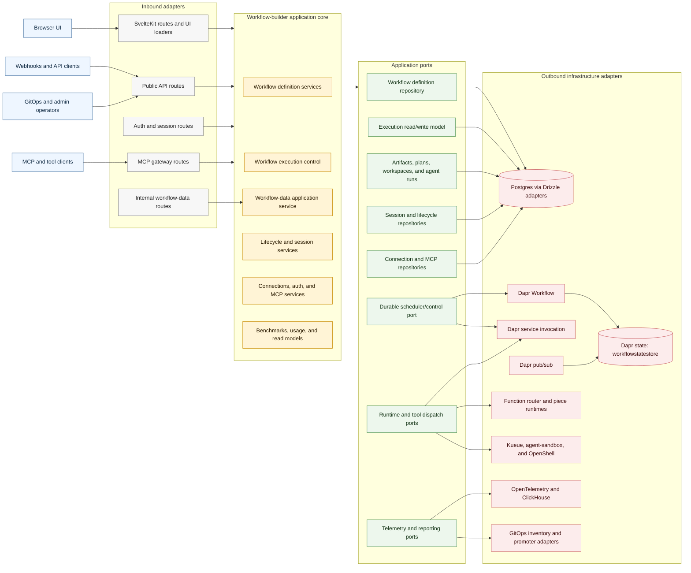
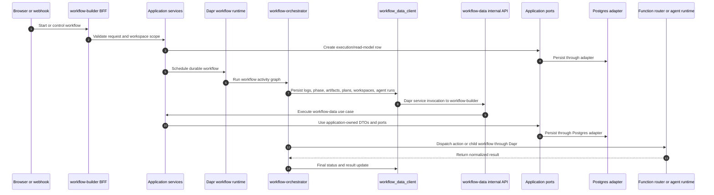
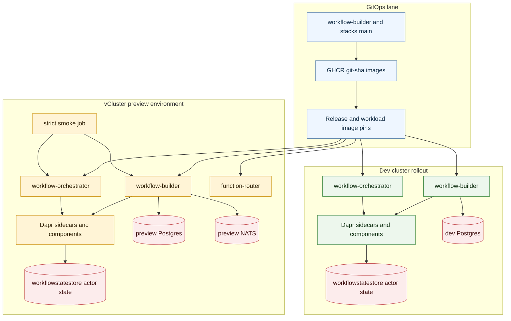

# Workflow Builder Hexagonal Architecture

Status: 2026-07-04, after the strict workflow-data cutover.

This diagram represents the current target shape of the workflow-builder system:
business use cases live behind application ports, infrastructure is hidden behind
adapters, and cross-service orchestration persistence enters workflow-builder
through Dapr service invocation and the internal workflow-data API.

## System Shape

## Orchestration Persistence Boundary

The Python workflow-orchestrator no longer owns runtime persistence in strict
mode. It calls workflow-builder through the workflow-data port over Dapr service
invocation. Postgres remains the first persistence adapter, but it is behind the
workflow-builder application boundary.

Strict mode invariant:

- `WORKFLOW_DATA_API_MODE=http` uses workflow-data over Dapr and does not fall
  back to direct Postgres access.
- `http-fallback-db` and rollback paths are documented separately from the
  runtime path.
- Legacy `app.py` helper behavior remains isolated from migrated runtime
  activities.

## vCluster Preview Isolation

Preview environments use the same ports and adapters as shared environments, but
they run with isolated infrastructure and strict workflow-data mode so portability
problems surface before promotion.

## Current Invariants

- UI routes are presentation adapters. Business rules, persistence decisions, and
  infrastructure calls belong in application services and adapters.
- Orchestrator runtime persistence enters through workflow-data over Dapr service
  invocation.
- Drizzle schema types stay inside Postgres adapter code.
- The single visible Dapr actor state store is `workflowstatestore`.
- Postgres is retained as the first adapter, not as a service-to-service
  coupling contract.
- vCluster preview smoke tests run in strict HTTP/Dapr mode before GitOps
  promotion.
